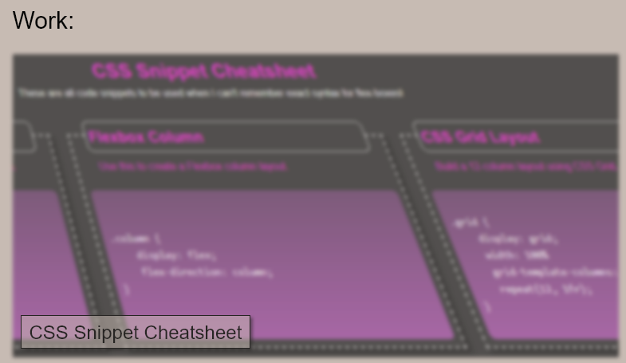

# portfolio-html-css-projects

## Description
A professional-ish work-in-progress portfolio for my html and css work.

I wanted to test my recently acquired skills with flex-boxes to make a readable and easy to navigate portfolio for my HTML and CSS projects.

Along the way, after much trial and error, I have accomplished a satisfactory result all the while learning little tricks here and there.

## Installation

N/A

## Usage

Link to deployed project: [Click here!](https://t-willis.github.io/portfolio-html-css-projects/)

Link to project repository: [Click here!](https://github.com/t-willis/portfolio-html-css-projects)

Using the nav bar on the right side of the header you can automatically navigate to the corresponding section within the webpage.

When you hover your cursor over each of the images within the 'Work' section the image will expand outward and unblur. Clicking this image will open a new browser tab to the corresponding project.

Hovering your mouse over the objects within the 'Contact' section will expand the images or underline the text. Clicking on any of the objects will open a new browser tab to the corresponding link, or open your email client.

## Credits

[Meyerweb.com reset.css](https://meyerweb.com/eric/tools/css/reset/)